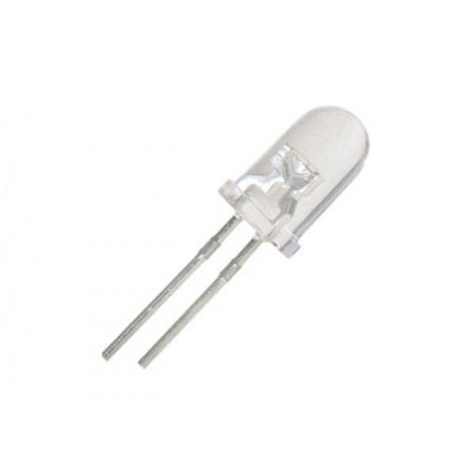

# Technology
The project is built in a STM32 Nucleo-64 board, in which we implemented an ultrsonic proximity sensor and a motion sensor: respectively one of them is used to determine when a car is parked in a certain parking lot, while the other is used to determine when a pedestrian is walking near the pole. In this way, with the second sensor we are able to understand when to turn on the light always connected to the board.
For the software components, we created the main firmware file in Riot OS (it is an operating system for the embedded systems), and we use MQTT-S connection to communicate between every devices of each car park and the “main” device that manages the area in question (the aggregating gateway); we also use MQTT to forward the information of the area to our cloud broker, in this particular case AWS cloud. After the cloud has collected the parking data in a specific area, these are shown and available for consultation by the user within a web page.
Let’s look at these components in more details.

## Hardware

### STM-32 Nucleo Board

STM32 Nucleo-64 board: The STM32 Nucleo-64 board provides an affordable and flexible way for users to try out new concepts and build prototypes by choosing from the various combinations of performance and power consume features, provided by the STM32 microcontroller. It has 1 user LED shared with ARDUINO, 1 user and 1 reset push-buttons, 32.768 kHz crystal oscillator, board connectors and flexible power-supply options.
 
 
The databrief is available here: https://www.st.com/resource/en/data_brief/nucleo-f401re.pdf

### Ultrasonic Sensor

Ultrasonic sensor HC-SR04: The HC-SR04 ultrasonic sensor uses sonar to determine distance to an object like bats or dolphins do. It offers excellent non-contact range detection with high accuracy and stable readings in an easy-to-use package. It operates in a distance range going from 2cm to 400 cm. Its operation is not affected by sunlight or black material.
The sensor come with 4 pins that correspond:

- VCC = +5VDC.
- Trig = Trigger input of Sensor.
- Echo = Echo output of Sensor.
- GND = GND.

Datasheet is available here: https://cdn.sparkfun.com/datasheets/Sensors/Proximity/HCSR04.pdf

### Movement Sensor

HC-SR501 PIR Sensor: HC-SR501 PIR Sensor detects motion by measuring changes in the infrared (heat) levels emitted by surrounding objects. When motion is detected the PIR sensor outputs a high signal on its output pin.
HC-SR501 PIR Sensor has an adjustable delay before firing and adjustable sensitivity. Runs on 4.5-20V, Digital signal output is High 3.3 V / Low 0V. Sensing range is about 7 meters (100 degree cone). Turning potentiometer clockwise increases sensing range (about 7 meters), on the contrary, sensing range decreases (about 3 meters).
 
 
Datasheet is available here: https://www.robotpark.com/image/data/PRO/91118/31227sc.pdf

### LED Light

